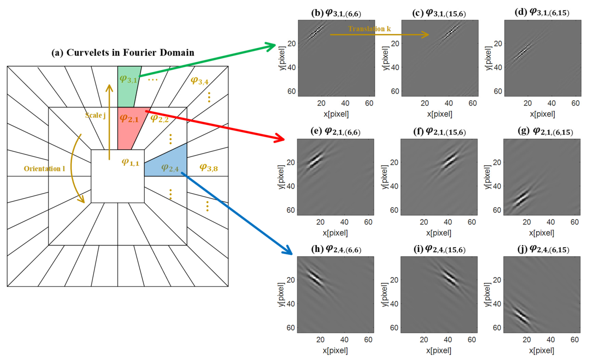
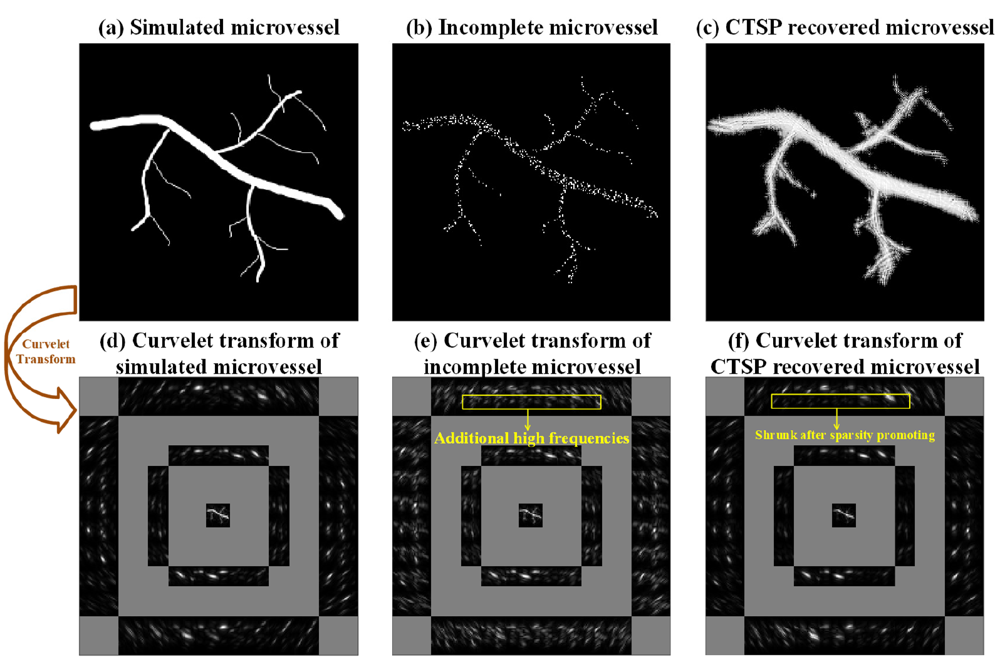
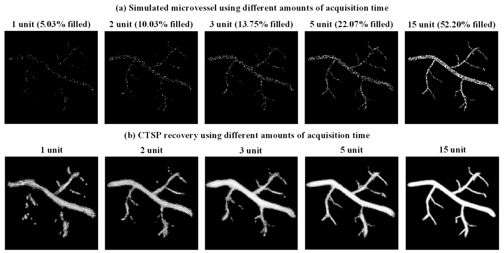
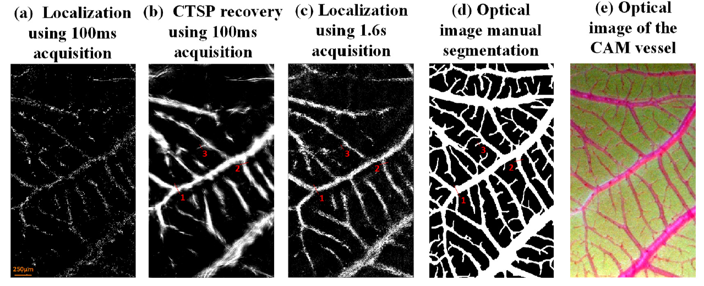
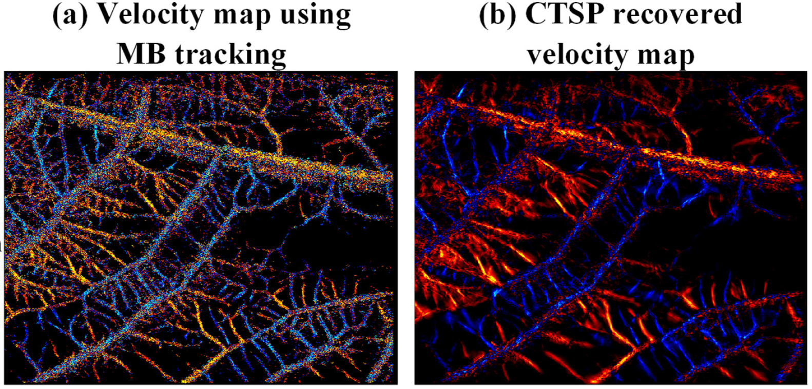

This is the implemetation of the algorithmn introduced in the [CTSP Paper](https://ieeexplore.ieee.org/abstract/document/9743950).

CTSP uses curvelet transform to reconstruct vessel structures.

# Start
- To Run the code, start from CAM.m or SimVessel.m

# Folder Structure
- "fdct" folder includes the curvelet transform/inverse transform introduced by E. J. Candès [[Fast Discrete Curvelet Transform]](https://epubs.siam.org/doi/abs/10.1137/05064182X)

- "recon" folder includes the iteration function used for recover the incomplete image

- "data" folder includes the incomplete/complete data from a simulated vessel and an in-vivo chicken embryo chorioallantoicmembrane (CAM)

# Curvelet Transform
- Curvelet transform decomposes a signal in spatial domain into a combination of a series of curvelet bases. The curvelet bases are a series of waveforms defined with three parameters: scale j , orientation l, and translation k. These three parameters define the support of curvelet bases in Fourier domain.
 

- Smooth curve-shape stuctures have sparse distribution in curvelet domain.
 

# Result
- Simulated Vessel

- CAM Vessel

- CAM Flow Velocity

